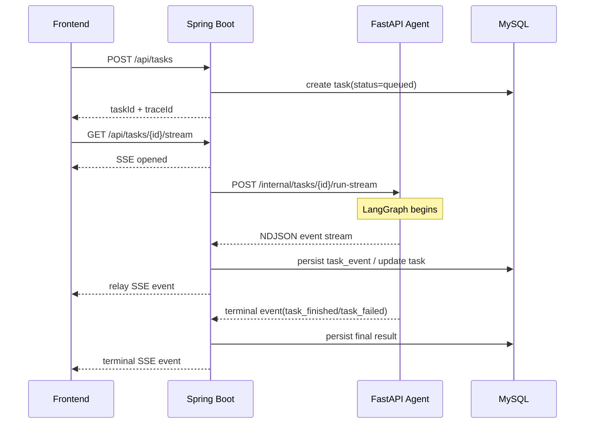

# 自然语言对话与流式分析初版架构方案

## 1. 文档目的

本文档基于当前仓库在 `2026-08-29` 的代码状态，给出“自然语言提问 -> AI 分析 -> 过程流展示 -> 结果返回”的初版可实施方案。

本文档重点回答四个问题：

1. 初版主链应该怎么设计。
2. 每段链路该用什么协议。
3. 继续沿用当前技术栈是否合理。
4. 和 `dataease/SQLBot` 的可借鉴点分别是什么。

## 2. 当前项目约束

结合仓库现状，当前方案必须遵守以下约束：

1. 前端已经是 `Vue 3 + Vite + TypeScript + Tailwind + ECharts`，工作台页面和任务状态模型已经基本成型。
2. Java 是统一业务入口，承载登录态、权限、审计和数据集边界，前端不能绕过 Java 直连 Python。
3. Python Agent 已选型为 `FastAPI + LangGraph + langchain-openai`，适合承载执行链路。
4. 当前前端鉴权使用 `Authorization: Bearer`，同时请求携带 `credentials: include`，这会影响 SSE 客户端选型。
5. 当前代码中虽然规划了 `Kafka + Worker`，但主链尚未打通，若第一版直接上队列、回调、SSE 三套并发机制，联调成本会偏高。

## 3. 对 SQLBot 的借鉴结论

`SQLBot` 的对话主链核心做法不是“前端直连 Python”本身，而是下面两点：

1. 后端把任务拆成很多增量事件，而不是等完整结果后一次性返回。
2. 后端持续输出带 `type` 的流式片段，例如 SQL 生成片段、图表结果片段、完成事件和错误事件。

`SQLBot` 当前是单后端模式，前端直接请求 FastAPI 并获取 `text/event-stream`。你当前项目不能照搬这个部署形态，但可以借鉴它的“typed incremental events”设计。

## 4. 初版总架构

### 4.1 架构原则

1. Java 继续做控制面。
2. Python 继续做执行面。
3. 浏览器只和 Java 通信。
4. Java 对前端统一输出 SSE。
5. Python 对 Java 输出内部流，不直接面向浏览器。

### 4.2 初版链路



### 4.3 初版协议选择

| 链路 | 协议 | 选择理由 |
|---|---|---|
| 前端 -> Java 创建任务 | `HTTPS REST` | 创建任务天然是请求-响应模型 |
| 前端 <- Java 任务流 | `SSE` | 浏览器单向消费过程事件最简单 |
| Java -> Python 执行请求 | `HTTP POST` | 初版先打通链路，避免同时引入队列复杂度 |
| Python -> Java 增量输出 | `application/x-ndjson` 流 | 服务间流比 SSE 更轻，Java 解析和测试更直接 |

## 5. 为什么初版不用 Kafka 打主链

Kafka 不是不需要，而是不适合作为第一步。

第一版最核心的目标是：

1. 让真实任务能从输入框进入 Agent。
2. 让 SQL、结论、图表和过程事件逐步展示到前端。
3. 让任务状态、事件和结果可落库、可追踪。

如果一开始就采用 `Java -> Kafka -> Python Worker -> callback -> Java SSE`，会同时引入：

1. 队列投递与消费时序问题。
2. 事件重放与幂等问题。
3. 流式文本与异步任务的双重状态同步问题。
4. 本地联调链路过长的问题。

因此初版建议：

1. 先用 `Java -> Python HTTP 流` 打通主链。
2. 等主链稳定后，再把“执行触发”替换成 Kafka。
3. 之后让 Worker 接管执行调度，Java 继续保留对前端的 SSE 出口。

## 6. 技术栈建议

### 6.1 前端

保留：

1. `Vue 3`
2. `TypeScript`
3. `Vite`
4. `Tailwind CSS`
5. `ECharts`

新增建议：

1. `@microsoft/fetch-event-source`

理由：

1. 当前前端鉴权依赖 `Authorization` 头。
2. 浏览器原生 `EventSource` 无法稳定自定义请求头。
3. `fetch-event-source` 可以在保持 SSE 语义的同时发送 Bearer Token，且更适合做错误处理和重连控制。

### 6.2 Java

保留：

1. `Java 21`
2. `Spring Boot 3.5`
3. `Spring MVC`
4. `Spring Security`
5. `MyBatis-Plus`
6. `MySQL`

新增或重点使用：

1. `SseEmitter`
2. `java.net.http.HttpClient`

理由：

1. 你当前依赖是 `spring-boot-starter-web`，做 SSE 不必切到 WebFlux。
2. `SseEmitter` 足够支撑工作台任务事件流。
3. Java 21 自带 `HttpClient` 足够消费 Python 的 NDJSON 流，先不要为了内部流引入额外技术栈。
4. Java 必须继续持有权限、审计、任务状态这三个事实源。

### 6.3 Python Agent

保留：

1. `Python 3.12`
2. `FastAPI`
3. `LangGraph`
4. `langchain-openai`
5. `Pydantic`
6. `SQLAlchemy`

建议新增：

1. `sqlglot`
2. `pandas`

理由：

1. `LangGraph` 适合做节点化执行和状态传递。
2. `FastAPI StreamingResponse` 适合内部增量输出。
3. `sqlglot` 比单纯关键字黑名单更适合做 SQL AST 校验、单语句检查和表名提取。
4. `pandas` 足够完成第一版聚合和图表前处理。

## 7. 初版任务与事件模型

### 7.1 任务状态

1. `queued`
2. `running`
3. `needs_review`
4. `succeeded`
5. `failed`

### 7.2 事件类型

初版建议统一为以下事件：

1. `task_started`
2. `context_built`
3. `sql_delta`
4. `sql_ready`
5. `query_executed`
6. `answer_delta`
7. `chart_ready`
8. `human_review_required`
9. `task_finished`
10. `task_failed`

### 7.3 Python -> Java 的 NDJSON 事件格式

```json
{"seq":1,"taskId":"task-001","traceId":"trace-001","eventType":"task_started","level":"info","timestamp":"2026-08-29T18:00:00+08:00","payload":{"message":"任务已启动"}}
{"seq":2,"taskId":"task-001","traceId":"trace-001","eventType":"sql_delta","level":"info","timestamp":"2026-08-29T18:00:02+08:00","payload":{"text":"SELECT order_month,"}}
{"seq":3,"taskId":"task-001","traceId":"trace-001","eventType":"sql_ready","level":"success","timestamp":"2026-08-29T18:00:03+08:00","payload":{"sql":"SELECT ...","reasoning":"按月聚合营收"}}
{"seq":4,"taskId":"task-001","traceId":"trace-001","eventType":"answer_delta","level":"info","timestamp":"2026-08-29T18:00:06+08:00","payload":{"text":"过去12个月营收整体呈上升趋势。"}}
```

### 7.4 Java -> 前端 SSE 格式

Java 对前端输出标准 SSE，`data` 保持和内部事件一致：

```text
event: message
id: evt-0001
data: {"taskId":"task-001","traceId":"trace-001","eventType":"answer_delta","level":"info","timestamp":"2026-08-29T18:00:06+08:00","payload":{"text":"过去12个月营收整体呈上升趋势。"}}
```

### 7.5 前端渲染规则

1. `sql_delta` 追加到 SQL 预览缓冲区。
2. `sql_ready` 用最终 SQL 覆盖预览区，并展示 SQL reasoning。
3. `answer_delta` 追加到回答缓冲区。
4. `chart_ready` 以完整图表配置刷新图表区。
5. `task_finished` 和 `task_failed` 视为终态，并触发一次详情刷新。

## 8. 模块拆分

### 8.1 `frontend-web/docs/modules/workbench`

负责：

1. 创建任务。
2. 订阅 SSE。
3. 消费增量事件。
4. 展示过程、SQL、回答和图表。

### 8.2 `backend-java/docs/modules/job`

负责：

1. `POST /api/tasks`
2. `GET /api/tasks/{id}`
3. `GET /api/tasks/{id}/stream`
4. 调用 Python 内部流接口。
5. 落库任务与事件。
6. 将内部流转成浏览器 SSE。

### 8.3 `backend-java/docs/modules/gateway`

负责：

1. 工作台 bootstrap 数据。
2. 健康检查。
3. 聚合类接口。

不负责：

1. 长任务执行。
2. Python 流消费。

### 8.4 `backend-agent/docs/apps/agent_api`

负责：

1. 接收 Java 下发的执行请求。
2. 启动 LangGraph。
3. 返回 NDJSON 增量事件流。

### 8.5 `backend-agent/docs/packages/graph_runtime`

负责：

1. 节点编排。
2. 节点状态。
3. 关键事件发射。

### 8.6 `backend-agent/docs/packages/tool_sql`

负责：

1. 生成只读 SQL。
2. 执行 SQL AST 和白名单校验。
3. 运行受限查询。
4. 输出 SQL 说明和结果摘要。

## 9. 初版与二阶段演进

### 9.1 初版

1. `前端 -> Java`：REST
2. `Java -> 前端`：SSE
3. `Java -> Python`：HTTP
4. `Python -> Java`：NDJSON Stream

### 9.2 二阶段

1. `Java -> Kafka` 投递执行任务。
2. `Worker` 消费 Kafka。
3. `Worker -> Java` 通过 callback 或 Kafka result topic 回传。
4. Java 仍然负责前端 SSE。

## 10. 初版开发顺序

1. Java 提供真实 `POST /api/tasks`、`GET /api/tasks/{id}`、`GET /api/tasks/{id}/stream`。
2. Python 提供 `POST /internal/tasks/{id}/run-stream`，先返回固定流式事件。
3. 前端把 `workspace-store` 从 mock 改为 API + SSE 消费。
4. Python 将固定流替换成真实 LangGraph。
5. 补全 SQL guard、图表生成、终态持久化。

## 11. 最终结论

对你当前项目，最可行的初版不是“前端直连 Python”，也不是“一开始就 Kafka 化”，而是：

1. 外部采用 `REST + SSE`。
2. 内部采用 `HTTP + NDJSON Stream`。
3. Java 保持权限、状态、审计和 SSE 出口。
4. Python 专注执行链路与增量事件生产。
5. 先借鉴 SQLBot 的流式事件设计，再在第二阶段引入 Kafka 和 Worker。
